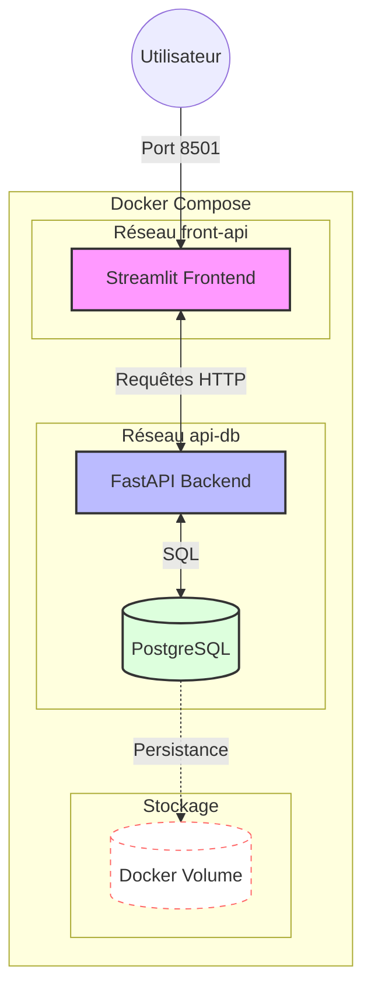

# Projet 2 : Orchestration, Sécurité et Livraison Continue (CD)

Ce second projet fait passer votre "Toolbox" à l'échelle supérieure. Vous allez transformer votre script Python en une **architecture micro-services** complète, sécurisée et déployable automatiquement.

## 1. Objectifs du Projet

* **Orchestration** : Piloter plusieurs services (Front, API, BDD) simultanément.
* **Persistance** : Gérer les données avec PostgreSQL et les volumes Docker.
* **Sécurité** : Maîtriser les variables d'environnement et la détection de fuites de secrets.
* **Livraison (CD)** : Automatiser la création et le stockage de vos images sur DockerHub.

## 2. L'Architecture Cible

Votre application doit être composée de trois services distincts :

1. **Frontend (Streamlit)** : Interface utilisateur (Page 0 : Saisie / Page 1 : Affichage).
2. **API (FastAPI)** : Le cerveau qui traite les requêtes et parle à la BDD.
3. **Database (PostgreSQL)** : Le stockage persistant des données.

> Chaque partie à son propre `pyprojet.toml` (API et Frontend), la base de données sera lancé depuis son image docker officielle.

---

## 3. Étapes de Développement

### Phase A : La Logique Métier (Local)

* [ ] **SQLite de test** : Développez votre module `sqlalchemy` pour qu'il fonctionne d'abord sur une base SQLite locale.
* [ ] **API FastAPI** : Créez deux routes : `POST /data` (sauvegarde) et `GET /data` (récupération).
* [ ] **Logique métier** : séparez vos codes dans votre dossier API (maths, connexion, crud, data)
* [ ] **Frontend Streamlit** : Concevez les deux pages demandées.
* [ ] **Tests** : Validez votre API avec Pytest (maths et api).

> **Attention** à ne pas versionner la base de données `sqlite`.

Comme on ne test que l'API on peut configurer le `pyproject.toml` de l'api pour qu'il connaisse le chemin des tests

```toml
[tool.pytest.ini_options]
# On force pytest à considérer le dossier app_api comme une source
pythonpath = ["."] 
testpaths = ["tests"]
```

Les tests seront lancés simplement depuis la racine avec cette commande:

```bash
uv run pytest app_api/tests
```

### Phase B : Variables d'Environnement et Hygiène

* [ ] **Extraction** : Sortez les URLs, logins et mots de passe de votre code.
* [ ] **Gestion des fichiers** :

* `.env` : Contient vos secrets (exclu par `.gitignore`).
* `.env.example` : Template vide pour expliquer quelles variables sont nécessaires.
* `.dockerignore` : Empêchez l'envoi de `.env`, `.venv` et `__pycache__` dans vos images.

### Phase C : Orchestration Docker Compose (test en local)

* [ ] **Réseaux (Networks)** : Créez deux réseaux :

* `front-api` : Pour la communication Streamlit <-> FastAPI.
* `api-db` : Pour la communication FastAPI <-> PostgreSQL (**la BDD doit être invisible pour le Front**).

* [ ] **Volumes** : Configurez un volume pour que les données de PostgreSQL ne disparaissent pas au redémarrage des conteneurs. Testez d'éteindre et de rallumer les services et regarder sur streamlit si les données sont toujours là.

### Schéma approximatif de l'architecture (Orchestration Docker)



---

## 4. Automatisation et Distribution (GitHub & DockerHub)

### CI Améliorée (Gitleaks)

Mettez à jour votre `.github/workflows/ci.yml` si besoin puis:

* Ajoutez un scan **Gitleaks** (`security.yml`) pour vérifier qu'aucun secret n'est présent dans votre historique Git.
* **Défi** : Faites exprès de pousser une variable dans un commit, constatez l'échec de la CI, puis nettoyez votre historique.

### Livraison Continue (CD)

Créez un nouveau workflow `.github/workflows/cd.yml` :

* **Déclenchement** : Uniquement si la CI est "Verte" sur la branche `main`.
* **Action** : Se connecter à DockerHub via les **GitHub Secrets**.
* **Versioning** : Builder et pusher vos images avec deux tags spécifiques (ex: le hash du commit Git `${{ github.sha }}` et le tag `latest`). En cas de problème vous pouvez revenir au conteneur lié à un push précédent.

```yaml
    steps:
    - name: Build and Push
            uses: docker/build-push-action@v5
            with:
              context: ./app_api
              push: true
              tags: |
                ${{ secrets.DOCKERHUB_USERNAME }}/mon-api:latest
                ${{ secrets.DOCKERHUB_USERNAME }}/mon-api:${{ github.sha }}  
```

Pour que le **CD** se déclenche uniquement après que le **CI** soit validé on peut mettre la condition dans le `cd.yml`

```yaml
on:
  workflow_run:
    workflows: ["CI Standardisation Projet 1"] # Doit correspondre exactement au 'name' dans ci.yml
    types:
      - completed
    branches:
      - main
```

Comme ça le **CD** ne s'execute que si le **CI** passe au vert!

### Orchestration finale

Créez le `docker-compose` : **`docker-compose.prod.yml`** qui ne build mais charges les `latest` versions de vos images. Partagez votre code avec un autre groupe et testez que tout fonctionne bien.

---

## 5. Structure Finale du Dépôt

```plaintext
.
├── .github/
│   ├── workflows/
│   │   ├── ci.yml         # Linting, Tests, Gitleaks
│   │   └── cd.yml         # Build & Push DockerHub
│   ├── CONTRIBUTING.md
│   └── CODE_OF_CONDUCT.md
├── app_front/             # Service Streamlit
│   ├── main.py
│   ├── pages
│   │   ├── 0_insert.py
│   │   └── 1_read.py  
│   ├── pyproject.toml
│   ├── uv.lock
│   └── Dockerfile
├── app_api/               # Service FastAPI
│   ├── Dockerfile
│   ├── pyproject.toml
│   ├── uv.lock
│   ├── models/            # Dossier contenant le modèle pydantic
│   │   ├── __init__.py
│   │   └── models.py      # modèle pydantic
│   ├── modules/           # Dossier contenant la logique du projet 1
│   │   ├── __init__.py
│   │   ├── connect.py     # Contient les operations de connexion et de CRUD
│   │   └── crud.py        # Contient les operations de CRUD
│   ├── maths/             # Dossier contenant la logique du projet 1
│   │   ├── __init__.py
│   │   └── mon_module.py  # Contient les fonctions add, sub, square, print_data
│   ├── data/              # Dossier contenant les data du projet 1
│   │   └── moncsv.csv     # Données d'entrée pour la démonstration
│   └── main.py            # Point d'entrée de l'application
├── tests/
│   ├── test_api.py
│   └── test_math_csv.py   
├── docker-compose.yml         # Pour le développement (build: .)
├── docker-compose.prod.yml    # Pour la prod (image: user/repo:tag)
├── conftest.py
├── .gitignore
├── .dockerignore
└── .env.example
 

```

---

## 6. Livrables attendus

* [ ] Un dépôt GitHub avec tous les badges (CI, Coverage) au vert.
* [ ] Un fichier `docker-compose.prod.yml` permettant de lancer votre application complète en téléchargeant uniquement les images depuis DockerHub.
* [ ] La preuve que Gitleaks est actif dans votre pipeline de sécurité.
